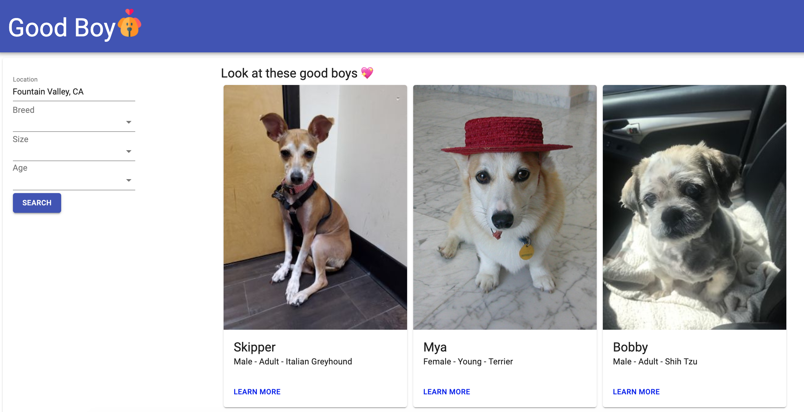

# Good Boy

A dog adoption website. Dog lovers can specify requirements and


## Getting Started

Prerequisites: Node.js version 10+

1. Make a copy of the application by cloning the repo

```
git clone https://github.com/jshamoo/good-boy.git
```

2. Navigate to good-boy directory

```
cd good-boy
```

3. Install dependencies

```
npm install
```

4. Start webpack dev server

```
npm run dev
```

## Built With

- [React](https://reactjs.org/docs/getting-started.html)
- [React Router](https://reacttraining.com/react-router/web/guides/quick-start)
- [Webpack Web Server](https://webpack.js.org/configuration/dev-server/)
- [Material-UI](https://material-ui.com/getting-started/installation/)

## Acknowledgments

[Front End Master](https://frontendmasters.com/courses/complete-react-v5/)
